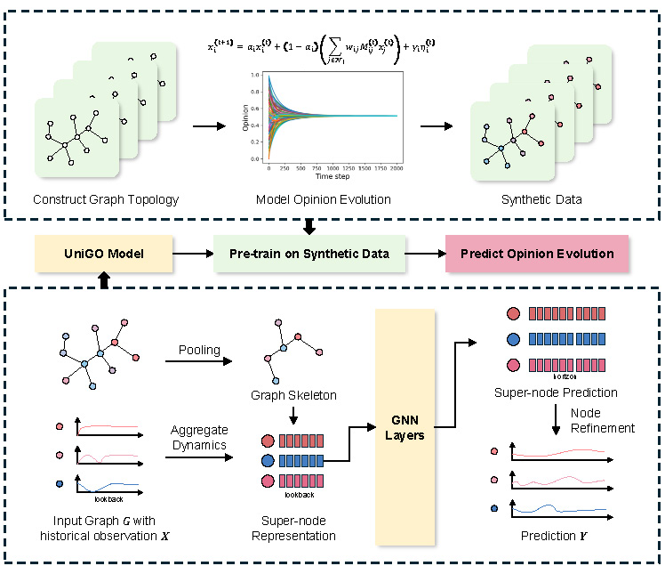
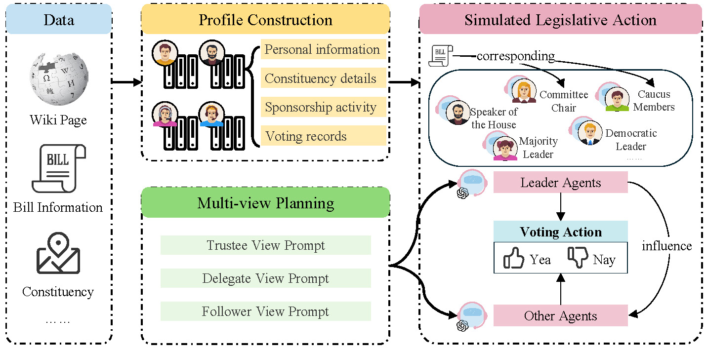
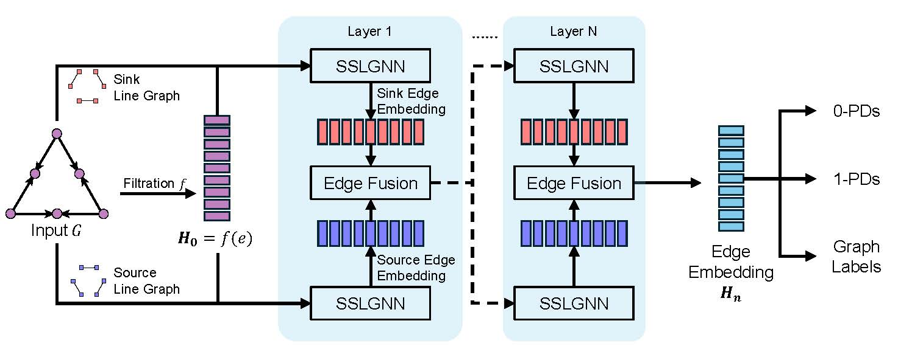
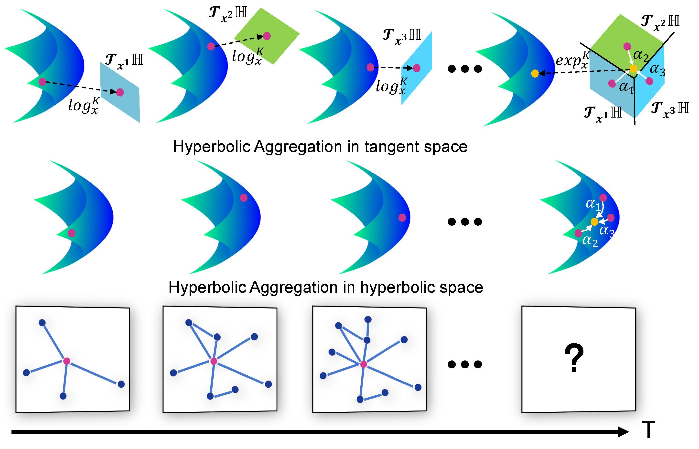
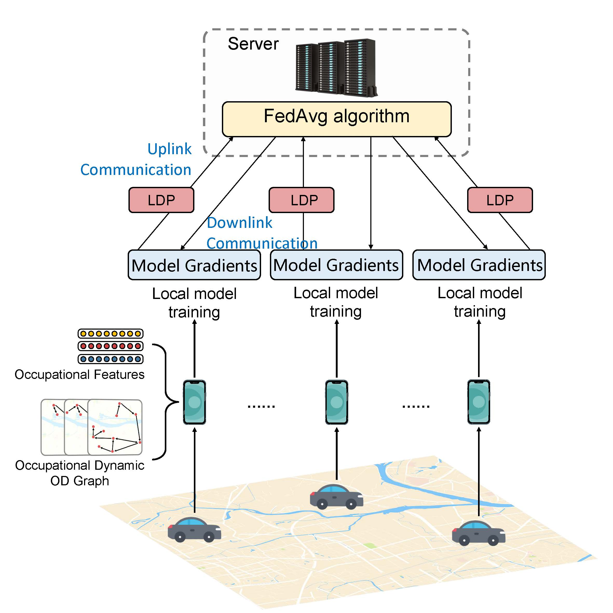








Hello, I am Hao Li, a third-year Ph.D. student at the School of Electronic Information at Wuhan University, under the supervision of Professor [Hao Jiang](http://eis.whu.edu.cn/index/szdwDetail?rsh=00007828&newskind_id=20160320222026165YIdDsQIbgNtoE). My research interests lie in the integration of social networks, graph neural networks, and large language models.

🌟[Email](whulh@whu.edu.cn) / [Github](https://github.com/Lihaogx) / [Wechat](../images/wechat.jpg) / [Google Scholar](https://scholar.google.com/citations?hl=zh-CN&user=xv78JsEAAAAJ)

# 🔎 Research 
My research interests lie in the integration of social networks, graph neural networks, and large language models. Specifically, I work in the following areas:

1. **Graph Neural Networks**
   - Dynamic Graph Embedding
   - Persistent Homology on graphs

2. **Social Networks and Graph Neural Networks**
   - Opinion Dynamics on Graphs
   - Special Structures in Social Graphs

3. **Large Language Models for Social Sciences**
   - Agents and Social Simulation
   - Enhancing Sociological Research through Large Language Models

# 🔥 News

  <ul>
    <li><strong>2025.01:</strong> Our paper "UniGO: A Unified Graph Neural Network for Modeling Opinion Dynamics on Graphs" has been accepted by <strong>WWW 2025</strong>. 🎉 See you in Sydney!</li>
    <li><strong>2025.12:</strong> Our paper "Political Actor Agent: Simulating Legislative System for Roll Call Votes Prediction with Large Language Models" has been accepted as an oral presentation by <strong>AAAI 2025</strong>. 🎉 See you in Philadelphia!</li>
    <li><strong>2024.05:</strong> One paper "Dynamic Neural Dowker Network: Approximating Persistent Homology in Dynamic Directed Graphs" has been accepted at <strong>KDD 2024</strong>. 🎉 See you in Barcelona!</li>
  </ul>

# 📃 Publications 

  
  

    <h3><a href="https://openreview.net/forum?id=bElAkCL6zb#discussion" target="_blank">UniGO: A Unified Graph Neural Network for Modeling Opinion Dynamics on Graphs</a></h3>
    
<strong>Hao Li</strong>, Jiang Hao, Yuke Zheng, Hao Sun, Wenying Gong 
    THE WEB CONFERENCE, 2025

  

 

  
  

    <h3><a href="https://arxiv.org/abs/2412.07144" target="_blank">Political Actor Agent: Simulating Legislative System for Roll Call Votes Prediction with Large Language Models</a></h3>
    
<strong>Hao Li</strong>, Ruoyuan Gong, Jiang Hao 
    Proceedings of the AAAI conference on artificial intelligence(AAAI), 2025

  

 

  
  

    <h3><a href="https://dl.acm.org/doi/abs/10.1145/3637528.3671980" target="_blank">Dynamic Neural Dowker Network: Approximating Persistent Homology in Dynamic Directed Graphs</a></h3>
    
<strong>Hao Li</strong>, Jiang Hao, Fan Jiajun, Ye Dongsheng, Du Liang 
    Proceedings of the 30th ACM SIGKDD Conference on Knowledge Discovery and Data Mining (KDD), 2024

  

 

  
  

    <h3><a href="https://www.sciencedirect.com/science/article/abs/pii/S092523122301161X" target="_blank">DHGAT: Hyperbolic representation learning on dynamic graphs via attention networks</a></h3>
    
<strong>Hao Li</strong>, Hao Jiang, Dongsheng Ye, Qiang Wang, Liang Du, Yuanyuan Zeng, Liu yuan, Yingxue Wang, Cheng Chen 
    Neurocomputing

  

 

  
  

    <h3><a href="https://ieeexplore.ieee.org/abstract/document/10415798/" target="_blank">Federated Learning for Privacy-Preserving Prediction of Occupational Group Mobility Using Multi-Source Mobile Data</a></h3>
    
<strong>Hao Li</strong>, Jiang Hao, Haoran Xian, Qimei Chen 
    IEEE International Conference on Data Mining (ICDM), 2023

  

# 📝 Service
### Conference Reviewer
- Reviewer for WWW'2025
- Reviewer for ICWSM'2025
- Reviewer for KDD'2024
- Reviewer for ICDM'2024

# 🎓 Educations
- 2015-2019 Bachelor's Degree, Electronic Information School, Wuhan University, China
- 2019-present Integrated Master-Ph.D. Student, Electronic Information School, Wuhan University, China
